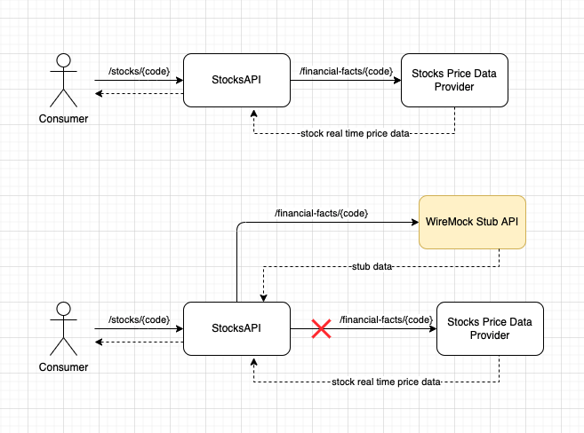

# WireMock Sample Project

This project was created aiming to demonstrate WireMock usage
while executing integration tests. 

## Building & Running this application

* Open a new terminal window:
  * Go to cloned project folder;
  * Type `./gradlew build`
  * Type `./gradlew bootRun`

* Once it starts, open a new browser window and type:
  * `http://localhost:8181/api/stocks/appl`
  * You should see a JSON response with APPL stock details

## WireMock in action

As you might see, this application is very simple with a _StockController_ that uses _StockService_ to call
an external API called _financial-facts_. This external API would be responsible by providing more details
related to a specific stock; then, once our application receives the external data, it can play with its own
business logic properly. 

Inside the test folder, we have a test class called _WiremockTutorialApplicationTests_ running with _wiremock_
profile active. All test methods call our controller and then, when calling the external API, WireMock' stubs act 
as proxy and return a response previously setup either programmatically (inside the respective test method) or from 
files located into resource folder. The picture below illustrates this flow.

## Additional Resources
 For more information about how WireMock works, feel free
 to take look on the [official documentation.](http://wiremock.org/docs/) 